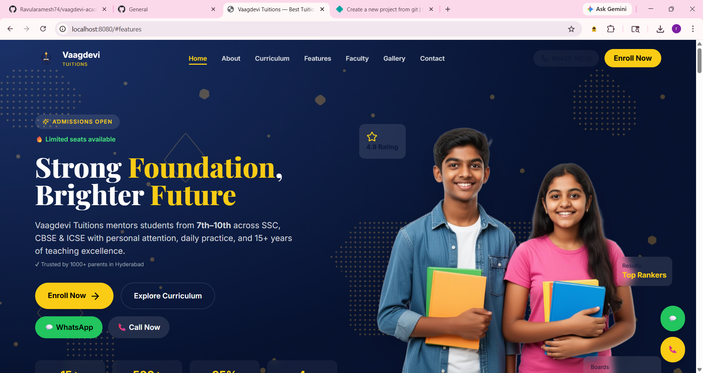
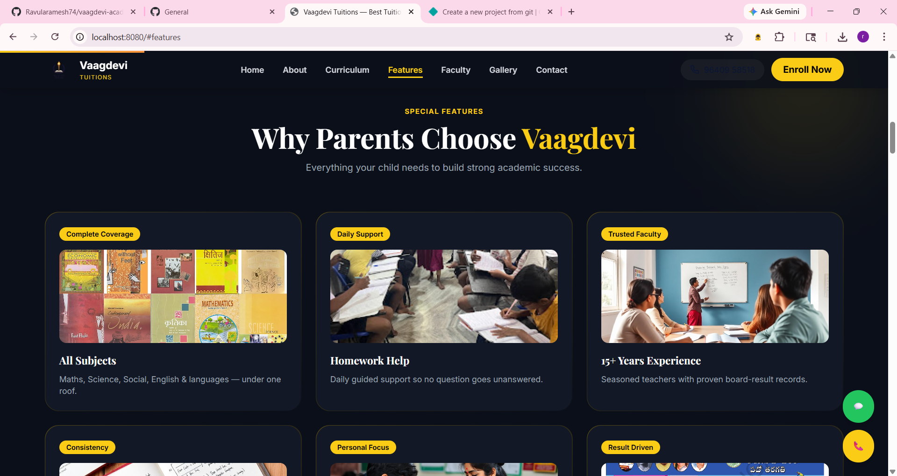
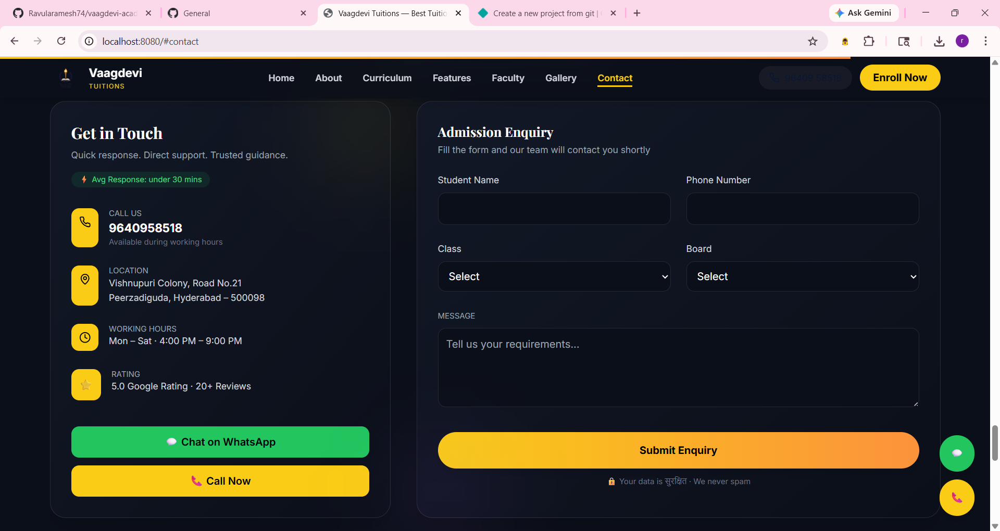

# 🎓 Vaagdevi Tuitions — Premium Educational Platform

> **Learn Today · Lead Tomorrow**
> A modern, high-performance web platform for Vaagdevi Tuitions — designed to deliver a premium digital experience for students and parents.

---

## 🚀 Overview

Vaagdevi Tuitions is a **conversion-focused, visually premium website** built to showcase:

* 📘 Curriculum (7th–10th)
* 👨‍🏫 Faculty expertise
* ⭐ Testimonials & results
* 📊 Performance stats
* 📞 Seamless enquiry system

Built with a **modern UI/UX approach** inspired by top-tier products.

---

## ✨ Features

### 🎯 Core Features

* 🔥 Hero section with conversion-focused CTAs
* 📚 Curriculum breakdown with interactive cards
* 👨‍🏫 Faculty profiles with trust signals
* ⭐ Testimonials (carousel + ratings)
* 📊 Animated stats (1000+ students, 95% success)
* 🖼️ Gallery with premium layout
* 📄 Pamphlet preview + download
* 📞 Contact form with WhatsApp integration

---

### 🎨 UI/UX Features

* 🌑 Dark premium theme
* ✨ Glassmorphism + gradients
* 🎬 Smooth animations & transitions
* 📱 Fully responsive design
* ⚡ Fast performance optimized

---

### 💰 Conversion Features

* 📲 WhatsApp & Call CTAs everywhere
* ⏳ Urgency indicators (limited seats)
* 🧠 Trust signals (ratings, results)
* 🎯 Optimized section flow

---

## 🛠️ Tech Stack

| Category   | Technology         |
| ---------- | ------------------ |
| Frontend   | React + TypeScript |
| Routing    | React Router       |
| Styling    | Tailwind CSS       |
| Icons      | Lucide React       |
| Animations | CSS + JS           |
| Build Tool | Vite               |

---

## 📁 Project Structure

```
src/
│
├── components/
│   ├── Header.tsx
│   ├── Hero.tsx
│   ├── Features.tsx
│   ├── Curriculum.tsx
│   ├── Faculty.tsx
│   ├── Testimonials.tsx
│   ├── Stats.tsx
│   ├── Pamphlet.tsx
│   ├── Contact.tsx
│   ├── Footer.tsx
│
├── pages/
│   └── NotFound.tsx
│
├── assets/
├── lib/
└── App.tsx
```

---

## ⚙️ Installation & Setup

### 1️⃣ Clone the Repository

```bash
git clone https://github.com/your-username/vaagdevi-tuitions.git
cd vaagdevi-tuitions
```

### 2️⃣ Install Dependencies

```bash
npm install
```

### 3️⃣ Run Development Server

```bash
npm run dev
```

### 4️⃣ Build for Production

```bash
npm run build
```

---

## 🌐 Environment Variables

Create `.env` file:

```
VITE_PHONE=9640958518
VITE_WHATSAPP=919640958518
```

---

## 📸 Screenshots (Optional)

> Add screenshots here for better presentation

```



```
---

## 🧠 Design Philosophy

* **Minimal but powerful**
* **Conversion-first layout**
* **Emotion + trust driven UI**
* **Fast & responsive experience**

---

## 🔥 Performance Optimizations

* Lazy loading images
* Optimized assets
* Minimal re-renders
* Lightweight animations

---

## 🚀 Deployment

You can deploy on:

* ▲ Vercel
* Netlify
* Firebase Hosting

---

## 📞 Contact

**Vaagdevi Tuitions**
📍 Hyderabad, India
📞 +91 96409 58518
📧 [vaagdevituitions@gmail.com](mailto:vaagdevituitions@gmail.com)

---

## 🏆 Future Improvements

* 🔄 Backend integration (Node.js / MongoDB)
* 📊 Admin dashboard
* 📈 Analytics tracking
* 📲 Mobile app version

---

## 📄 License

This project is licensed under the MIT License.

---

## 💡 Final Note

This project is designed not just as a website, but as a **high-conversion educational platform**.

> “Great UI attracts users. Great UX converts them.”
